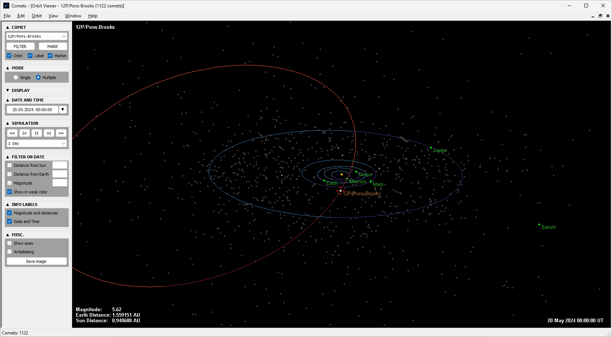

## Comets

*Ready to Refactor (Work In Progress...)*

---

Inspired by [Comet for Windows](http://www.aerith.net/project/comet.html).  
Incorporates more advanced version of [OrbitViewer.NET](https://github.com/jurakovic/OrbitViewer.NET).  

### Features

- Calculate ephemeris

- Plot graph with visual magnitude or distance to Sun or Earth

- *3D* Orbit Viewer

---

### Archive

In the beginning no actual source control system was used. Instead there were multiple copies of folders in "[*Final*](https://phdcomics.com/comics/archive.php?comicid=1531)"-like manner. In April 2024 all that folder copies were migrated to git to preserve history the right way. More details about that in [archive/Readme.md](https://github.com/jurakovic/Comets/blob/archive/readme/Readme.md).  

---

More to come...
