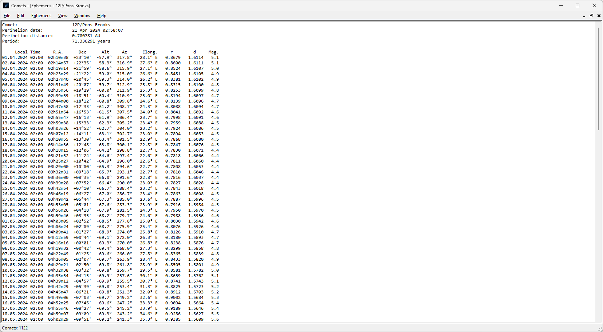
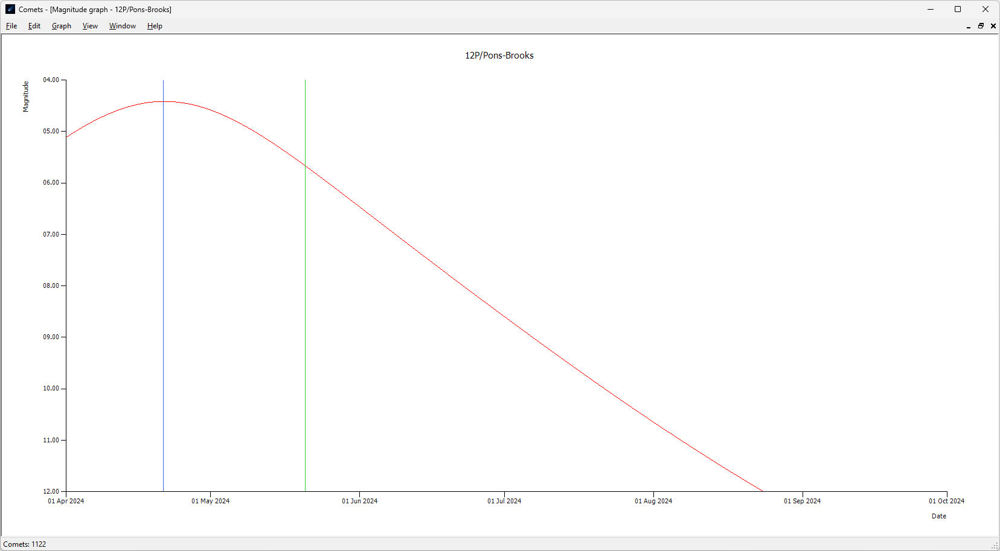

# Comets

*Ready to Refactor (Work In Progress...)*

---

## Features

- Calculate ephemeris
- Plot graph with visual magnitude or distance to Sun or Earth
- *3D* Orbit Viewer
- Orbital elements converter (all [MPC](https://www.minorplanetcenter.net/iau/Ephemerides/Comets/SoftwareComets.html) formats supported, and some more)
- Dark theme

## Credits

Inspired by [Comet for Windows](http://www.aerith.net/project/comet.html).  
Includes advanced version of [OrbitViewer.NET](https://github.com/jurakovic/OrbitViewer.NET) (C# rewrite of [OrbitViewer](https://www.astroarts.co.jp/products/orbitviewer/index.html)).  
Dark theme thanks to [Dark-Mode-Forms by BlueMystical](https://github.com/BlueMystical/Dark-Mode-Forms) (my fork [here](https://github.com/jurakovic/Dark-Mode-Forms)).  

## Download

[Latest Release](https://github.com/jurakovic/Comets/releases/latest)

## Screenshots

## Resources

Books and other open source astronomy software and libraries used for reference.

#### Books

[Astronomical Algorithms](https://www.amazon.com/Astronomical-Algorithms-Jean-Meeus/dp/0943396352) by Jean Meeus (2nd ed., Willmann-Bell, 1998)  
[Astronomical Formulae for Calculators](https://www.amazon.com/Astronomical-Formulae-Calculators-Jean-Meeus/dp/0943396220/) by Jean Meeus (Willmann-Bell, 1988)  
[Practical Astronomy with your Calculator or Spreadsheet](https://www.amazon.com/Practical-Astronomy-your-Calculator-Spreadsheet/dp/1108436072/) by Peter Duffett-Smith and Jonathan Zwart (Cambridge, 2011)  

#### Software

[Cartes du Ciel (SkyChart)](https://www.ap-i.net/skychart/en/start)  
[Celestia](https://celestiaproject.space/)  
[Stellarium](https://stellarium.org/)  
[JPL OrbitViewer](https://ssd.jpl.nasa.gov/tools/orbit_viewer.html)  
[PlanetDroid](https://www.strickling.net/android_en.htm#PlanetDroid) by Wolfgang Strickling  
[AstroLib](https://mhuss.com/AstroLib/) by Mark Huss  
[Javascript AstroTools](https://web.archive.org/web/20150923180018/http://www.ngc7000.org/astrotools/ephemtool.html) by Ole Nielsen  
[ProjectPluto](https://www.projectpluto.com/source.htm) by Bill Gray  

---

### Archive

In the beginning no actual source control system was used. Instead there were multiple copies of folders in "[*Final*](https://phdcomics.com/comics/archive.php?comicid=1531)"-like manner. In April 2024 all that folder copies were migrated to git to preserve history the right way. More details about that in [archive/Readme.md](https://github.com/jurakovic/Comets/blob/archive/readme/Readme.md).  
